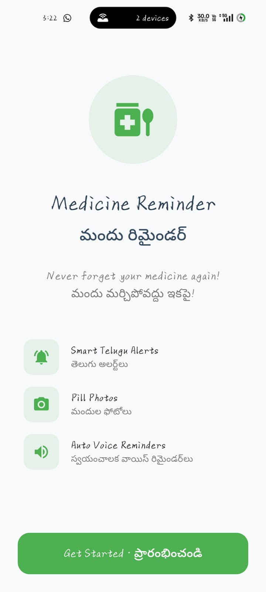
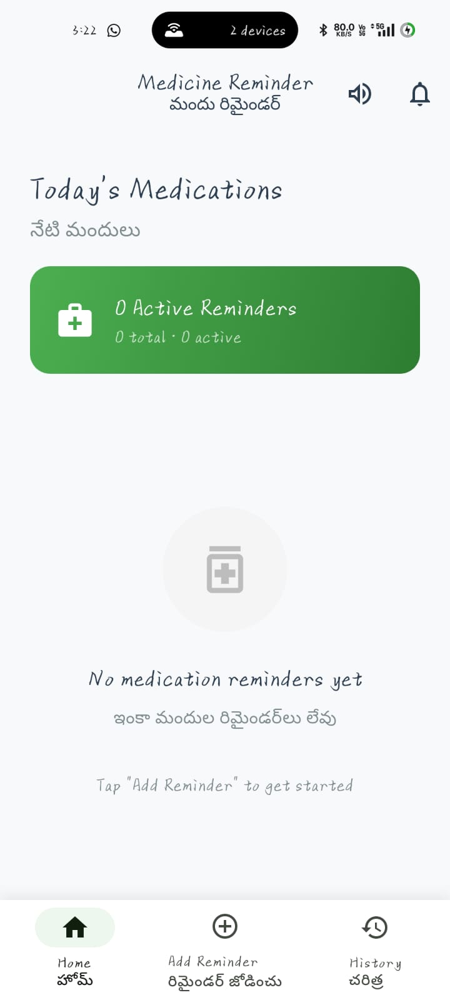

# MediRem

A Flutter app that helps users set medication reminders with local notifications and optional FCM push.

## Features
- Create, edit, and cancel medication reminders
- Local notifications (Android) via `flutter_local_notifications`
- Optional Firebase Cloud Messaging integration

## Build (Android)
```bash
# get deps
flutter pub get

# debug run
flutter run

# release APK
flutter build apk --release

# release App Bundle (Play Store)
flutter build appbundle --release

## 📱 Screenshots

### Welcome Screen


### Home Screen


### Set Reminder Screen


### Notification Example

